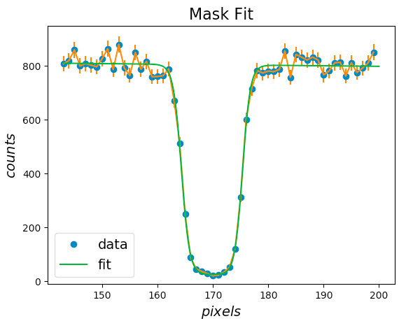

## detector-mask-fit

Performs a custom sigmoidal fit to find the lower edge position (in pixels)
of a motorized mask in front of a neutron area detector.

A small test data set is given in the mask_data folder.

Here's an example plot with fit:

____
#### 
